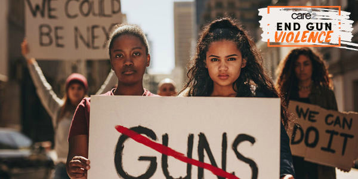
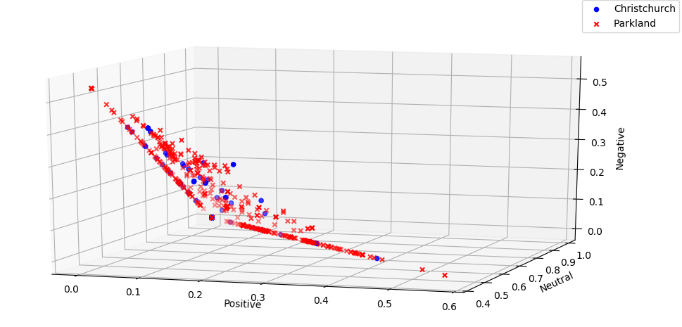
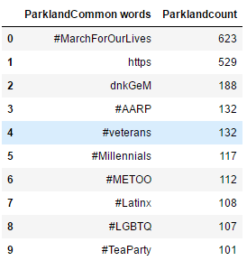
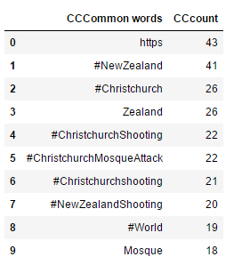
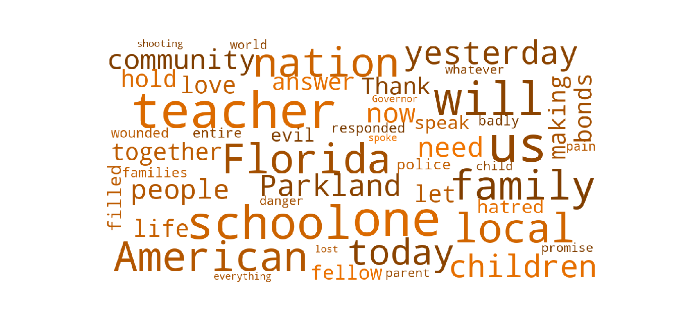
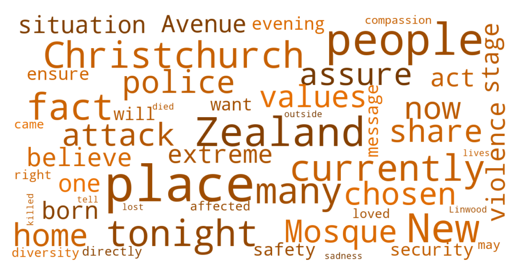

## Priyanka Khanal
## Twitter Reacts: Gun Violence
### Introduction

 
Gun violence has increased significantly in the past decade. Not just in United States, gun violence is increasing all over the world. This project analyzes the rectioon of twitter to two different gun violence incidents of recent times. The first incident took place in Stoneman Douglas High School shooting in Parkland, Florida on February 14, 2018. This school shooting is deadliest high school shooting spree in the history of United States which led to 17 deaths and 14 non-fatal injuries.

The second incident took place consequitively at two mosques in Christchurch, New Zealand on March 15, 2019. This terriost attack led to 50 deaths and 50 non-fatal injuries.

### Sentiment Analysis

The above 3d plot shows that most of the tweets were either positive or neutral for both the incidents whereas there were some that were negative. The negative tweets might be the one that share the experiences. 

### Most Frequently Used "Words"
<table><tr>
<th>
</th>
<th>  </th>
</tr></table>
 
Both the table shows 10 most frequently used words in the 10000 tweets gathered with the hashtag. This is a very interesting finding. Both the incidents have several other hastags attached to the hastag of the event. On one hand, Parkland shooting has touched various different areas which necessarily doesn't relate to the incident. For eg: #Metoo is a movement for sexual assault surviours or #Millenials. On the other hand, Christchurch shooting and teh hastags related are mainly focused on the same incident

### Text Anlaysis on the Speech given by the leader of respective countries

The above wordcloud shows randomly chosen 50 words from President Trump's speech after Parkland Shooting.
 

The above wordcloud shows randomly chosen 50 words from Prime Minister Ardern's speech after Christchurch Shooting.

### Conclusion
This project mainly compared the twitter reactions to such violent crimes. Even though these shooting happened in two differnt places on the world, Twitter did react similar way. The sentiment analysis of the tweets were very similar. BOth the leaders of the nations addresed the community and the families. Both the leaders talked about the nation. President Trump on one hand did not categorize this as an act of terrorism whereas Prime Minister Ardern did. The only major difference was the use of hashtag. Christchurch shooting hashtags were focused on the shooting itself whereas parkland shooting was focusing on other differnt areas which was not necessarily related to the shooting 